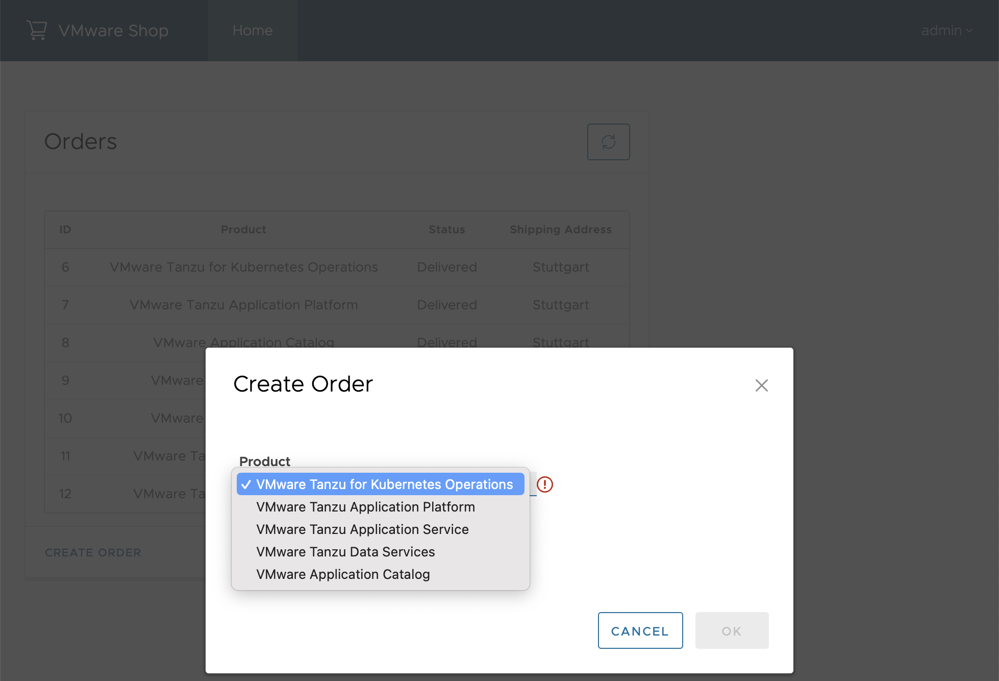
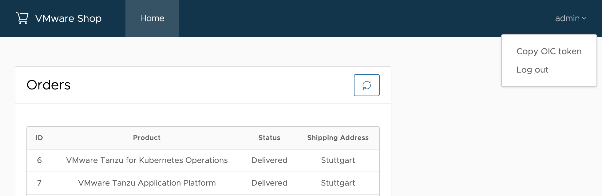

# Frontend

The frontend is a Single Page Application implemented in Angular and Typescript.
It consumes the REST API exposed by the [gateway](gateway.md).

It also provides the functionality to copy a OpenID Connect token to be used for TAP GUI's API documentation plugin.

