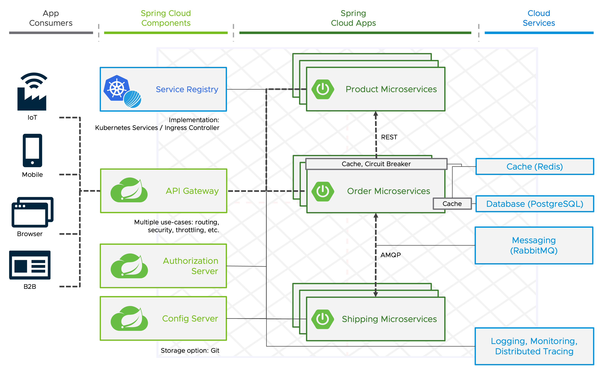

#  A typical Spring Cloud Architecture on VMware Tanzu Application Platform

This is a typical microservice application for a supply chain.

In the center of the slide we have the three microservices implemented using Spring Boot and initially created on https://start.spring.io.

The [product service](product-service.md) only has one REST endpoint to fetch the list of products and products are configurable via configuration properties.

With the [order service](order-service.md) REST API, clients are able to fetch the current orders that are stored in a PostgreSQL database and they are also able to create new orders.
The product id for a new order is validated with the list of products that will be fetched from the [product service](product-service.md) via a synchronous REST call.

After the order is created and stored in the database, information like the shipping address will be send to the [shipping service](shipping-service.md) via asynchronous messaging and after a configurable amout of time (for example 10 seconds) a status update for the delivery will be sent back via asynchronous messaging to be consumed by the [order service](order-service.md).

The APIs of the [product service](product-service.md) and [order service](order-service.md) are exposed via a [gateway](gateway.md) and consumed by a [frontend](frontend.md).

